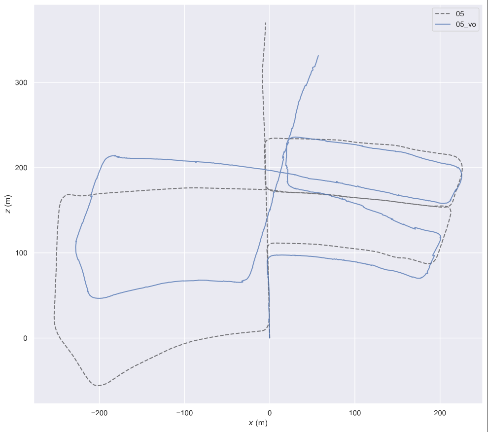

# mini_stereo_vo

A from-scratch stereo visual odometry (VO) system in C++ using the KITTI odometry dataset.

## Overview

This project implements a minimal yet complete stereo visual odometry pipeline with:

- stereo initialization from rectified image pairs
- feature tracking using optical flow
- pose estimation with PnP + RANSAC
- sequential VO with failure handling
- stereo reinitialization for long-term robustness
- trajectory evaluation using evo

The focus is on **clarity, correctness, and understanding**, rather than full SLAM completeness.

---

## Current Results

The system successfully runs through full KITTI sequences using:

- frame-to-frame tracking
- pose estimation with quality gating
- automatic stereo reinitialization when tracking degrades

### Trajectory Visualization



- Ground truth: smooth path
- Estimated VO: follows overall structure but accumulates drift over time

---

## Pipeline

### 1. Stereo Initialization

- ORB feature detection and matching between left/right images
- row and disparity filtering
- triangulation of 3D landmarks
- landmarks initialized in camera frame

### 2. Tracking

- features tracked across frames using pyramidal LK optical flow
- forward-backward consistency check
- invalid tracks filtered out

### 3. Pose Estimation

- 3D–2D correspondences constructed from tracked landmarks
- pose estimated using `solvePnPRansac`
- previous pose used as initial guess

### 4. Pose Validation

Pose is accepted only if:

- sufficient inliers
- sufficient inlier ratio
- reasonable frame-to-frame motion

Otherwise:

- previous pose is reused
- system enters degraded state

### 5. Reinitialization

Triggered when:

- tracking quality drops
- pose estimation fails or is rejected

Behavior:

- stereo reinitialization on current frame
- new landmarks triangulated
- transformed into world frame using last valid pose

---

## Limitations

This is a **pure VO system**, not full SLAM.

Missing components:

- global map optimization (Bundle Adjustment)
- loop closure
- keyframe-based map refinement
- landmark lifecycle management

### Resulting Behavior

- drift accumulates over time
- trajectory remains locally consistent
- global consistency is not enforced

This is expected and correct for the current system design.

---

## Repository Structure

```text
mini_stereo_vo/
├── include/svo/
│   ├── camera.h
│   ├── dataset_kitti.h
│   ├── estimator.h
│   ├── feature.h
│   ├── frame.h
│   ├── map_point.h
│   ├── stereo_initializer.h
│   └── tracker.h
├── src/
│   ├── camera.cpp
│   ├── dataset_kitti.cpp
│   ├── estimator.cpp
│   ├── stereo_initializer.cpp
│   ├── tracker.cpp
├── app/
│   └── run_kitti.cpp
├── scripts/
│   ├── bootstrap_ubuntu2404.sh
│   └── eval_kitti.sh
├── results/
│   ├── debug/
│   ├── tables/
│   ├── traj/
│   └── videos/
```

---

## Build

```bash
cmake -S . -B build -G Ninja
cmake --build build -j
```

---

## Run

```bash
./build/run_kitti data/kitti 05 results/traj/05_vo.txt
```

---

## Evaluation

```bash
scripts/eval_kitti.sh 05 results/traj/05_vo.txt
```

Produces:

- trajectory plots
- APE (absolute pose error)
- RPE (relative pose error)

---

## Key Observations

- VO works reliably across full sequences
- reinitialization prevents early failure
- pose gating avoids catastrophic jumps
- drift accumulates without global optimization

---

## Future Work

### Short-term improvements

- better pose validation (reprojection error)
- adaptive reinitialization thresholds
- landmark quality filtering

### Medium-term improvements

- keyframe insertion
- local bundle adjustment
- landmark re-triangulation

### Long-term extensions

- loop closure
- pose graph optimization
- full SLAM system

---

## Notes

This project is intentionally designed to:

- prioritize understanding over complexity
- build the VO pipeline step by step
- expose real-world failure modes (drift, tracking loss, reinitialization)

It is meant as a **learning-focused implementation of visual odometry**, not a production SLAM system.
