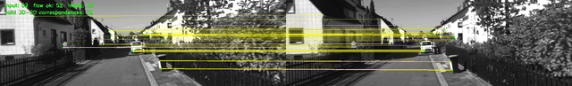

# mini_stereo_vo




Stereo visual odometry built from scratch in C++. Tracks a moving camera through the KITTI benchmark — no SLAM library, no shortcuts.

`C++ 17` · `Eigen3` · `OpenCV` · `CMake / Ninja` · `KITTI` · `evo`

---

## Pipeline

```
  Stereo image pair
         │
         ▼
  [Stereo Init]   ── ORB detect + match, row/disparity filter, triangulate ──▶  3D landmarks
         │
         ▼
   [Tracker]      ── pyramidal LK optical flow + forward-backward check ──────▶  2D tracks
         │
         ▼
  [Estimator]     ── PnP RANSAC → Gauss-Newton refinement (Huber loss) ───────▶  pose T_wc
         │
         ▼
  [Frontend]      ── quality gate, keyframe decision, stereo re-triangulation ▶  keyframe
         │
         ▼
    [Map]          ── sliding window: 5 keyframes · 2 000 landmarks ──────────▶  pruned map
         │
         ▼
  [Local BA]      ── joint pose + landmark optimization every 2 keyframes ────▶  refined poses
```

Each stage is a self-contained module (`include/svo/`, `src/`). The main loop in `app/run_kitti.cpp` orchestrates them — no hidden global state.

**Pose refinement** — after PnP RANSAC, a custom Gauss-Newton optimizer re-solves pose on inliers only, using Huber loss to suppress residual outliers. The refined pose replaces the RANSAC result only if reprojection RMSE improves.

**Failure recovery** — the frontend gates each pose on inlier count, inlier ratio, and motion magnitude. Consecutive rejections trigger stereo reinitialization: new landmarks are triangulated from the current frame and transformed into the world frame using the last valid pose, so the system recovers without losing global position.

---

## Results

| Tracking overlay | Inlier ratio over time |
|:---:|:---:|
|  |  |

Runs through all 2 761 frames of KITTI seq 05. Median inlier ratio 0.91. Trajectory follows ground truth with expected long-range drift — pure VO without loop closure or global optimization.

**KITTI seq 05 — evo metrics (best run)**

| Metric | RMSE | Mean | Median |
|:---|---:|---:|---:|
| APE (m) | 6.30 | 5.64 | 5.26 |
| RPE (m/frame) | 0.111 | 0.053 | 0.030 |

---

## Quick Start

**Dependencies** — Eigen3, OpenCV (core, imgcodecs, imgproc, highgui, features2d, video, calib3d). Install everything including `evo` with:

```bash
bash scripts/bootstrap_ubuntu2404.sh
```

**Build and run:**

```bash
# build
cmake -S . -B build -G Ninja && cmake --build build -j

# run (KITTI seq 05) — trajectory written to results/traj/05_<YYMMDD>[_<keyword>].txt
./build/run_kitti data/kitti 05 [pose_keyword] [--save-debug]

# evaluate APE / RPE — outputs plots to results/tables/05/
scripts/eval_kitti.sh 05 results/traj/<output>.txt

# regenerate README images
source .venv/bin/activate && python3 scripts/generate_vis.py --seq 05 --traj results/traj/<output>.txt

# regenerate tracking GIF (requires a prior --save-debug run)
source .venv/bin/activate && python3 scripts/make_tracking_gif.py --seq 05
```

---

## Repo Layout

```
mini_stereo_vo/
├── app/run_kitti.cpp          # entry point and pipeline orchestration
├── include/svo/               # module headers
├── src/                       # implementations
│   ├── stereo_initializer.cpp
│   ├── tracker.cpp
│   ├── estimator.cpp
│   ├── frontend.cpp
│   ├── map.cpp
│   └── viewer.cpp
├── scripts/
│   ├── generate_vis.py        # generate README assets
│   ├── make_tracking_gif.py   # assemble debug frames into tracking GIF
│   ├── eval_kitti.sh          # APE / RPE evaluation via evo
│   └── bootstrap_ubuntu2404.sh
├── assets/                    # images used in this README
└── results/
    ├── traj/                  # output trajectory files
    ├── debug/                 # per-frame tracking PNGs + stats CSV
    └── tables/                # evo evaluation plots
```
